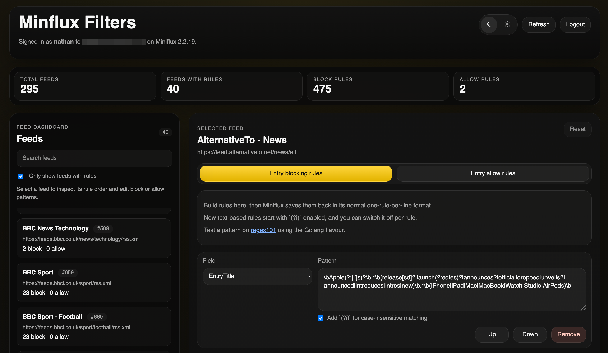

# Flux Filters

Flux Filters is a simple personal web app for managing Miniflux feed-level block and allow rules without changing how Miniflux stores them.

It was built to make managing regex filters for Miniflux feeds easier, while keeping the saved rule text fully compatible with Miniflux.



## Stack

- React 18
- TypeScript
- Vite
- Express
- Node.js 20+
- Docker
- Vitest
- ESLint

## Configuration

1. Create a `.env` file:

   ```bash
   cp .env.example .env
   ```

2. Update `.env`:

   - `PORT`
   - `MINIFLUX_ALLOWED_HOSTS`
   - `DOCKERHUB_USERNAME` for production Compose deployments

Environment notes:

- `PORT` defaults to `3000` for the Express server.
- `MINIFLUX_ALLOWED_HOSTS` should be set to the exact Miniflux host you trust.
- `DOCKERHUB_USERNAME` is only used by `docker-compose.prod.yml` to choose the published Docker image, currently `aut0nate/flux-filters`.
- The browser stores the Miniflux API token in session storage only.
- The app reads and writes Miniflux rules as plain text, one rule per line, without introducing a custom format.

## Run Locally

1. Install dependencies:

   ```bash
   npm install
   ```

2. Start the app:

   ```bash
   npm run dev
   ```

3. Open [http://localhost:5173](http://localhost:5173).

Notes:

- The Vite development server runs on port `5173`.
- `/api` requests are proxied to the Express server on port `3000`.

Before opening a pull request, run:

```bash
npm run lint
npm run test
npm run build
```

## Run with Docker

1. Create a `.env` file if you have not already:

   ```bash
   cp .env.example .env
   ```

2. Build and start the local container:

   ```bash
   docker compose up --build
   ```

3. Open [http://localhost:3000](http://localhost:3000).

Notes:

- The local Compose file builds from source and publishes port `3000`.
- Flux Filters does not need a local storage volume because it does not persist app data.

## CI/CD Deployment

GitHub Actions runs the full check on pull requests and branch pushes:

```bash
npm ci
npm run lint
npm run test
npm run build
docker build
```

The workflow also starts the built Docker image and checks `/api/health`.

When changes are pushed to `main`, GitHub Actions publishes Docker Hub images:

- `aut0nate/flux-filters:latest`
- `aut0nate/flux-filters:<full-git-sha>`

Required GitHub repository secrets:

- `DOCKERHUB_USERNAME`
- `DOCKERHUB_TOKEN`

Use a Docker Hub access token for `DOCKERHUB_TOKEN`, not your Docker Hub password.

Recommended GitHub settings for `main`:

- Require a pull request before merging.
- Require status checks to pass.
- Require branches to be up to date before merging.
- Block force pushes.
- Restrict deletions.
- Use squash merging.
- Automatically delete merged head branches.

Required check:

```text
Test, build, and publish
```

## Production Deployment

The production server should pull the published image instead of building from source. Keep only these files on the server:

```text
docker-compose.yml
.env
```

Use `docker-compose.prod.yml` from this repository as the server `docker-compose.yml`.

The production Compose file expects an existing external Docker network called `edge-net`, so create it once if needed:

```bash
docker network create edge-net
```

Deploy or update the app on the production server:

```bash
docker compose pull
docker compose up -d
docker compose logs -f
```

The production container exposes port `3000` only to `edge-net`. Point the reverse proxy at the `flux-filters` service on port `3000`.

## Security Notes

- Do not commit `.env` files or live credentials.
- Do not log Miniflux API tokens.
- Restrict `MINIFLUX_ALLOWED_HOSTS` to the Miniflux host you trust.
- The server acts only as a thin proxy and does not persist user sessions.
- Do not store source code on the production server once image-based deployment is working.

## AI-Assisted Development

Flux Filters was built with **OpenAI Codex using GPT-5.4**. This repository includes an [`AGENTS.md`](./AGENTS.md) file, which provides structured instructions and context for AI coding agents. It defines expectations, constraints, and project-specific guidance to help keep contributions consistent and reliable.

## Contributions

Contributions, ideas, and suggestions are welcome.

I am not a developer by trade, so if you have improvements, feature ideas, or bug fixes, feel free to open an issue or submit a pull request.
